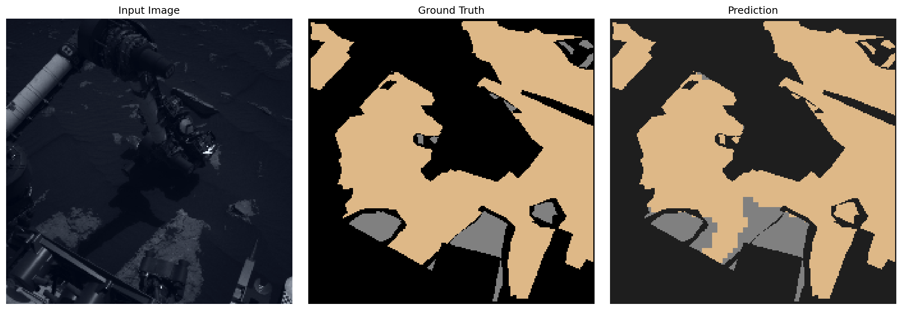

# 🚰 DinoMarsFormer: Semantic Segmentation of Martian Terrain

**DinoMarsFormer** is a semantic segmentation model designed for terrain classification on Mars, using a transformer-based backbone (DINOv2) paired with a custom, shallow decoder.

This project is a small showcase of my interest in the intersection of deep learning, space exploration and robotics.

---

## 🌍 Dataset: AI4Mars

* Based on imagery from the Curiosity Rover (MSL) on Mars.
* Semantic masks with 4 terrain classes:

  * **Soil**
  * **Bedrock**
  * **Sand**
  * **Big Rock**

More info: [AI4Mars Dataset](https://openaccess.thecvf.com/content/CVPR2021W/AI4Space/papers/Swan_AI4MARS_A_Dataset_for_Terrain-Aware_Autonomous_Driving_on_Mars_CVPRW_2021_paper.pdf)

---

## 🧠 Architecture Overview

```
                 +---------------------+
                 |     Input Image     |
                 +----------+----------+
                            |
                  [Frozen DINOv2 Backbone]
                            |
     +----------+----------+----------+----------+
     | Layer 3  | Layer 6  | Layer 9  | Layer 12 |   ← customizable
     +----+-----+----+-----+----+-----+----+-----+
          |          |          |          |
   [1x1 Conv + Norm]...        [1x1 Conv + Norm]
          |          |          |          |
    [ConvNeXtBlock] OR [MLP + Activation]  ← decoder-specific
          |          |          |          |
           \         |         /        
            \      [Upsample] /
             \     [Concat]  /
                [Fusion Block]
                      |
                [Final Classifier]
                      |
             +--------------------+
             |  Segmentation Map  |
             +--------------------+
```

### 🧹 Decoder Options

* **ConvNeXtDecoder**: Uses depthwise convolutions, residual connections, LayerNorm, and LayerScale for efficient spatial learning.
* **MLPDecoder**: A minimal, fast projection + fusion setup using 1x1 convolutions, inspired by SegFormer.

Both decoder types are fully interchangeable and configurable via the `decoder_type` argument. The set of ViT layers used can also be customized with `selected_layers`.

---

## 🖼️ Example Predictions

Below is an example of initial prediction results from the initial best trained model (with ConvNeXt decoder). These are early outputs and will be improved with further experiments.



---

## 📊 Evaluation

The model's performance is evaluated using standard segmentation metrics such as Mean IoU (Intersection over Union) and Dice Score.

### Results on `test_min3` version of the [dataset](https://huggingface.co/datasets/gustavv-andrzejewski/ai4mars-terrain-segmentation).

| Metric             | Value     |
| ------------------|-----------|
| Accuracy           | 0.879     |
| Mean IoU           | 0.720     |
| Dice Macro         | 0.805     |
| Dice Weighted      | 0.972     |
| Generalized Dice   | 0.805     |
| **IoU: Soil**      | 0.970     |
| **GDS: Soil**      | 0.985     |
| **IoU: Bedrock**   | 0.811     |
| **GDS: Bedrock**   | 0.880     |
| **IoU: Sand**      | 0.913     |
| **GDS: Sand**      | 0.954     |
| **IoU: Big Rock**  | 0.186     |
| **GDS: Big Rock**  | 0.402     |

These results reflect the early performance of the model and provide a strong baseline for future improvement with a particular focus on the unrepresented Big Rock class.

---
